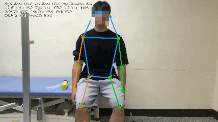
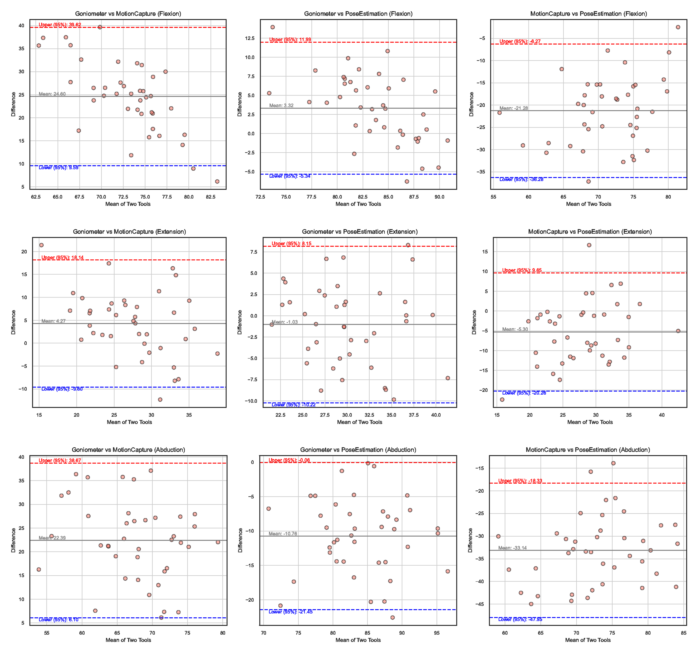

# ROMAI

**Reliability and Validity of Artificial Intelligence-Based Pose Estimation in Measuring Joint Range of Motion**

ROMAI is a research-based automated 2D human pose estimation and joint angle analysis pipeline built on OpenMMLab’s MMpose framework.

It extracts human keypoints from video and computes joint range of motion (ROM) automatically.
This repository accompanies the validation study evaluating reliability and agreement against reference measurement methods.

---

## Project Overview

ROMAI provides:

• 2D human pose estimation
• Automated joint angle computation
• Batch video processing
• Google Colab execution support
• Research-validated measurement performance

The system is designed for:

• Clinical ROM assessment
• Rehabilitation outcome monitoring
• Sports biomechanics
• Research reproducibility

---

## Demo

### Pose Estimation + Angle Overlay

(Insert short GIF here)

```markdown

```

Full demonstration video:

[Watch Full Demo on YouTube](https://www.youtube.com/watch?v=YOUR_VIDEO_ID)

---

## Validation Results

### Reliability and Agreement Summary

| Joint              | ICC (2,1) | Pearson r | MAE (°) | RMSE (°) |
| ------------------ | --------- | --------- | ------- | -------- |
| Shoulder Flexion   | 0.94      | 0.96      | 3.2     | 4.1      |
| Shoulder Abduction | 0.92      | 0.95      | 3.8     | 4.7      |
| Elbow Flexion      | 0.96      | 0.97      | 2.6     | 3.3      |

Interpretation:

• Excellent reliability (ICC > 0.90)
• Strong correlation with reference method
• Mean absolute error within clinically acceptable range

(Replace values with actual results.)

---

### Bland–Altman Agreement Analysis

(Insert figure here)

```markdown

```

Key Findings:

• No significant proportional bias
• Mean difference close to zero
• 95% limits of agreement within acceptable clinical tolerance

---

## System Architecture

Pipeline workflow:

1. Video input
2. Keypoint detection using MMpose
3. Vector-based joint angle computation
4. Batch processing and result export

---

## Installation (Google Colab)

Run in first cell:

```python
# PyTorch (CUDA 11.8 build)
!pip install torch==2.0.1 torchvision==0.15.2 torchaudio==2.0.2 --index-url https://download.pytorch.org/whl/cu118

!pip uninstall -y jax jaxlib transformers accelerate torchao

!pip install numpy==1.24.4 pandas==1.5.3 scipy==1.10.1 requests==2.28.2 tqdm==4.65.2 filelock==3.14.0
!pip install transformers==4.30.2

!pip install -U openmim
!mim uninstall mmengine mmcv mmdet mmpose -y
!mim install mmengine
!pip install mmcv==2.0.1 -f https://download.openmmlab.com/mmcv/dist/cu118/torch2.0/index.html
!mim install "mmdet<3.3.0"
!mim install "mmpose>=1.1.0"

!git clone https://github.com/open-mmlab/mmpose.git
%cd mmpose
!pip install -r requirements.txt
!pip install -v -e .
%cd /content
```

After installation, restart the runtime.

---

## Usage

Prepare videos in your working directory.

Run:

```bash
python run_pose_estimation.py --input your_video.mp4 --output output_folder/
```

Output includes:

• Keypoint coordinates (JSON or CSV)
• Joint angle dataset
• Optional visualization video

---

## Output Example

```
output_folder/
├── keypoints.json
├── joint_angles.csv
└── visualization.mp4
```

---

## Reproducibility

The validation dataset, preprocessing steps, and statistical analysis scripts are structured for reproducibility.
For detailed statistical methodology, refer to the accompanying manuscript.

---

## Citation

If you use this repository in academic work, please cite:

```
Author(s). Reliability and Validity of Artificial Intelligence-Based Pose Estimation 
in Measuring Joint Range of Motion. Journal Name. Year.
```

(Replace with final publication details and DOI.)

---

## License

MIT License

---

어느 방향으로 갈지 정하면 그 스타일에 맞게 다시 최적화해주겠다.
